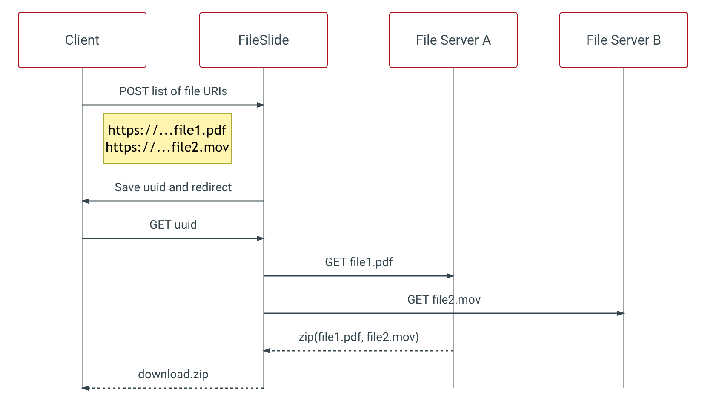

# fileslide-streamer

Open Source drop-in service for downloading multiple files as a single zip stream.

#### Say you have these 2 files on the web:

- [https://my-test-data-1.s3.amazonaws.com/central-park-bike-map.pdf](https://my-test-data-1.s3.amazonaws.com/central-park-bike-map.pdf) (~1MB)
- [https://s3.wasabisys.com/my-test-data-2/earth.mp4](https://s3.wasabisys.com/my-test-data-2/earth.mp4) (~1.5MB)

#### FileSlide lets your clients stream a ZIP download from a simple POST request:

```html
<form action="https://fileslide.io/download" method="post">
  <input type="hidden" name="fs_file_name" value="demo_download.zip" />
  <input
    type="hidden"
    name="fs_uri_list[]"
    value="https://my-test-data-1.s3.amazonaws.com/central-park-bike-map.pdf"
  />
  <input
    type="hidden"
    name="fs_uri_list[]"
    value="https://s3.wasabisys.com/my-test-data-2/earth.mp4"
  />
  <input type="submit" value="Download Zip of 2 Files" />
</form>
```

## Try the demo [https://hello.fileslide.io/](https://hello.fileslide.io/)

FileSlide Streamer is a Ruby Sinatra HTTP server that: (1) receives a POST request containing a list of file URIs; (2) saves and redirects to a GET request; (3) downloads and zips the listed files in parallel; and (4) returns a single zip file.



- See official documentation here: [https://hello.fileslide.io/docs](https://hello.fileslide.io/docs)

## Getting Started

FileSlide Streamer is a Ruby Sinatra application.

Running locally requires the following:

- Ruby >= 2.6.6
- Redis DB

The [rerun](https://github.com/alexch/rerun) gem is also recommended for development

To get started:

- Clone the [repository](https://github.com/whitebrick/fileslide-streamer)
- Copy the env file `mv .env.example .env`
- Update `REDIS_URI` in the `.env` file
- `bash scripts/start_dev.sh` to start the server

To run the demo with remote files and the remote test Authorization and Reporting endpoints:

- Open `test/static/local/demo.html` with a web browser

To run the demo with local files and the local demo Authorization and Reporting endpoints:

- `bash scripts/start_dev.sh` to start the server
- `bash scripts/start_test_file_server.sh` to start the local file server (serves from `test/file_server/files`)
- `bash scripts/start_test_upstream_server.sh` to start the local Authorization and Reporting server
- Update the `.env` file and set `AUTHORIZATION_ENDPOINT=http://localhost:9294/authorize` and
  `REPORT_ENDPOINT=http://localhost:9294/report`
- Open `test/static/local/demo.html` with a web browser

## Testing

To run the test suite, `cd test` then run `bundle exec rspec` from the root folder of the repo. For testing the zip streaming, the test suite covers starts up a second Puma process to deliver static files from spec/fixtures. You can extend this server with extra static files or custom endpoints as needed.

## Documentation

- See official documentation here: [https://hello.fileslide.io/docs](https://hello.fileslide.io/docs)
