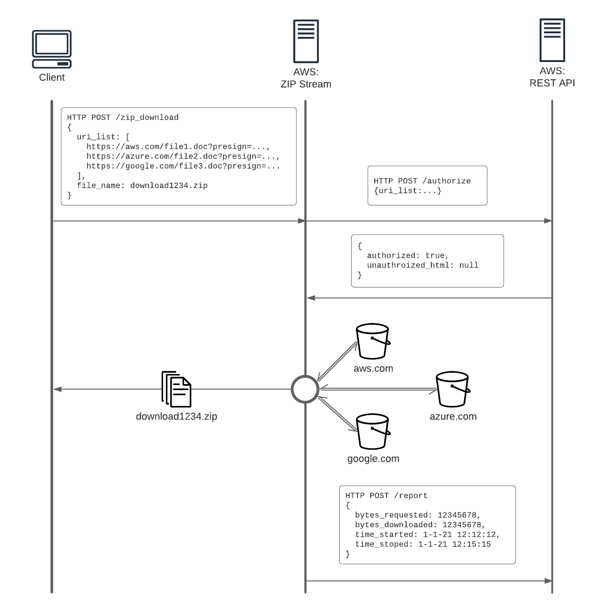

# fileslide-streamer

## Requirements

* A user makes a HTTP post request directly to the app with 1 or more pre-signed file download URIs encoded as a JSON array
* The app calls a REST API to ask if all of the specified URIs are authorized

> The way to think about it is kind of a "Zip-As-A-Service" - just say you have given me secret links (or pre-signed URLs) to file1, file2 & file3 on wander.com. Effectively I am just passing on my secret links to a middle-man (this zip_download app) which uses these same links to download the files for me, zip them up and give me the resulting output zip file.
>
> The authorization check is not for security, but works more of an "allow-list" for accounting/payment purposes
>
> So in this example, you would have already registered the following URL pattern with my other app (the REST API that's out of scope for this project)
>
> https://wander.com/data/*
>
> So each zip download URL is matched against that pattern and authorized: true is returned, and you (the data sharer) are charged for that zip download
>
> The secret link/presigned URL provides the actual authorization, this check just allocates who is paying for the extra effort of zip downloading files the user already has access to
>
> With this model, you could hypothetically register any public data too, say all of https://github.com/*, and then anyone can use the zip_download app to download a selection of random files as a zip from github by just posting what they want. The deterrent from doing this is that the user that registered github.com has to cover the bill
>
> So the most common use case is:
>
> - My other app authenticates scientists who want to download data they've been authorized to view, and then generates presigned URLs on demand when they click the download button
>
> - If they have checked the box for "zip all files as a single download" then they do a post to this zip_download app with all the URLs, otherwise they copy/paste the list of URLs directly and use wget or curl or a download manager plugin
>
* If false, the app returns 403 Forbidden and renders the returned HTML
* If true, the app requests the URIs, ZIPs and streams the response to the user
* After the download is complete or the connection is dropped or there is any other error, the app reports to the REST API
* The app is to be developed in Ruby/Rack
* The app is to be deployed and configured to run on AWS

### Scope for Phase I

- A ruby/rack app built with Sinatra and Puma to allow easy extensibility.
- Configuration via environment variables (ie location of upstream server, etc).
- When receiving a POST request to /zip_download it will verify the request with an upstream REST service at the /auth endpoint as in the diagram above.
- If approved, the app will sequentially download the contents of each URL, zip-ify them and stream them to the user. Filenames in the zip will equal the filenames in the URL.
- After the request is done (either successfully or not) the results will be posted to /report on the same upstream REST service.
- The app will have configuration for deployment to an AWS EC2 instance via Capistrano. (or if you prefer, I can write a Dockerfile for it so you can run in in Docker Swarm/Nomad/Kubernetes etc)
- The app will be performant enough for at least 50 concurrent users, within the hardware constraints from EC2 (ie, if an instance has a 10GBit/s internet connection and 20 users are streaming concurrently they can't be streaming faster than 500 MBit/s each on average). This should be doable for a single instance.
- Unit+integration tests
- Documentation about the basic working principles, how to deploy it and how to set it up locally for testing and development.

### NOT in scope for Phase I (but considered in design)

- Resumable downloads.
- Alternate archive streaming options like TAR or gzip.
- Inline compression or unpacking-and-repacking of already compressed files inside archives.
- The app will be constructed so that it could be scaled out horizontally if needed, but setting up of autoscaling groups and load balancers etc is not in scope for the initial part.
- Domain names etc. (Will it live on a subdomain of fileslide.io?)
- Generating or verifying the presigned URLs; the assumption is that if a user has a list of urls and they pass validation with the upstream REST service we trust them with no further questions.

## Points of note:

- Unlike WT, we are hoping to fetch files from any providers not just AWS S3 (eg Azure, Google, Wasabi, etc), therefore the download speed of files to the app may not be as fast/consistent, so the response stream to the client may need to be throttled accordingly
- If feasible, it would be great to support range requests so users can resume downloads

> Due to the structure of the ZIP file format, to support range requests (and thus resumable downloads) we need to have the CRC32 checksum of the file up front. Alternatively, we can compute the checksum while streaming but in that case range requests won't work since any given range request might not request the whole file. At WeTransfer the whole checksum computing operation was rather complex and took a significant amount of computing power, so it might be worth forgoing that if the benefits are small (for example, if the file sizes are reasonable and the expected users have a stable enough connection).

- The more simple, light-weight and lean the app the better
- We would take your advice on every aspect of the implementation, configuration, deployment and operation

